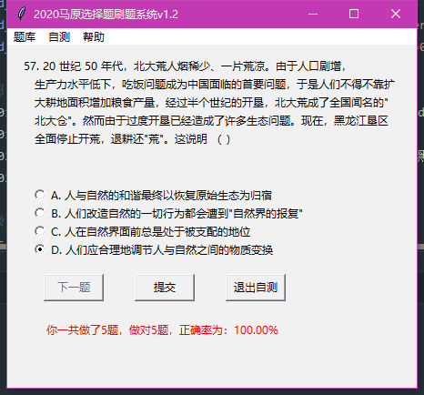

# 2020年马原选择题刷题系统

## 1.写在前面

非常欢迎大家试用本刷题系统！

本项目作者：机动学院17级丁泓宇(已征得本人同意转发，仅用于学习交流)

系统中的题目来自于：国贸171周子寒同学整理的“2019-2020学年马原选择题题库”。

所需运行环境：Python 3.7，直接运行 main.py 即可 (第一次运行需要一段时间，请耐心等待)。
也可选择下载不用Python环境依赖的新手友好向版本。

No picture, No truth:

## 2.库依赖

可通过git clone下载本项目，也可右转百度网盘。

2020/1/8 v1.2：
1. 确定了题目与答案信息的准确无误；
2. 优化了题目的格式与代码中变量的命名；
3. 加入了"随机自测"的刷题机制；
4. 更新了开发者信息。

- 下载地址(大佬向，需要配置安装环境，1.8MB)： 可直接在本网站下载压缩包或`git clone`

- 下载地址(`推荐`，新手友好向，下载后无需安装直接使用，148.5MB)：[百度云链接](https://pan.baidu.com/s/1VbYIruMvPKrF33Xqk88ZbA)

2020/1/6 v1.0：基础版本

- 下载地址(大佬向，需要配置安装环境，95KB)： [百度云链接](https://pan.baidu.com/s/1EWK69nF_cGFckmXyIRjeSQ) 

- 下载地址(新手友好向，下载后无需安装直接使用，148.2MB)：[百度云链接](https://pan.baidu.com/s/1vZPQ8TmMUbTuwCTBO_xrIA)

如选择需要配置安装环境，请安装python库依赖：

`pip install pandas`
`pip install xlrd `

(若出现问题请参考：https://www.jianshu.com/p/65cd9a72c1b0)

## 4.联系作者

系统中可能存在问题和漏洞，希望大家及时指出，也希望大家对我的代码提出优化建议和方案。

作者的联系方式：QQ 458026749 / Wechat&电话 18721666502

鸣谢：

最后，十分感谢曹旭同学的关键帮助！

祝大家刷题愉快~

